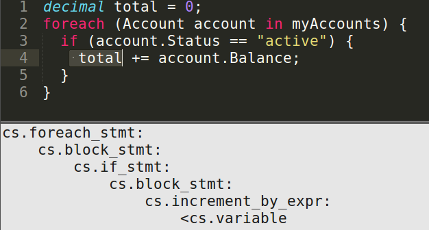

# CLQL
#### A Query Language for Software Systems

CodeLingo Query Language (CLQL) is a simple, lightweight language. It’s full grammar is under [70 lines of code](img/ebnf.png).

<br />

### Query Generation
 
When looking for patterns in code, CodeLingo's Integrated Development Environment (IDE) plugins can help build those patterns by automatically generating queries to detect selected elements of code. A generated query will describe the selected element and its position in the structure of the program:

#### Sublime


 
In the above example the break statement is selected. The generated CLQL query will match any break statement inside an if block inside a for loop, matching the nested pattern of the selected break element.

#### Visual Studio


Similar to Sublime example above, CodeLingo also provides a Visual Studio extenstion that generates a CLQL query. 

<br />

## Features

### Querying with Facts

<!--Should we include systems that CLQL does not *yet* support? -->
While CLQL can query many types of software related systems, this document will focus on querying a single CSharp program.

<!--TODONOW link to fact definition section on lexicon page-->
Queries are made up of [Facts](concepts/lexicons.md). A CLQL query with just a single fact will match all elements of that type in the program. The following query matches and returns all classes in the queried program:

`<cs.class` 

It consists of a single fact `<cs.class`. The namespace `cs` indicates that it belongs to the C# [lexicon](concepts/lexicons.md), and the fact name `class` indicates that it refers to a C# class.
The yield tag `<` determines which fact the query will return. Every query must have one (and only one) yielded fact.

<br />

### Fact Properties

To limit the above query to match classes with a particular name, add a "name" property as an argument to the `method` fact:
 
```
<cs.method:
  name: "myFunc"
```
 
This query returns all methods with the name "myFunc". Note that the yield tag is still on the `method` fact - properties cannot be returned, only their parent facts. Also note that properties are not namespaced, as their namespace is implied from their parent fact.

Facts with arguments are proceeded by a colon.

<br />

### Floats and Ints
<!--TODO(blakemscurr) explain boolean properties once syntax has been added to the ebnf-->
Properties can be of type string, float, and int. The following finds all int literals with the value 8:
 
```
<cs.int_lit:
  value: 5
```
 
This query finds float literals with the value 8.7:
 
```
<cs.float_lit:
  value: 8.7
```

<br />

### Comparison

The comparison operators >, <, ==, >=, and <= are available for floats and ints. The following finds all int literals above negative 3:
```
<cs.int_lit:
  value: > -3
```

<br />

### Regex

Any string property can be queried with regex. The following finds methods with names longer than 25 characters:
 
```
<cs.method:
  name: /^.{25,}$/
```

<br />

### Fact Nesting

Facts can be take arbitrarily many other facts as arguments, forming a query with a tree struct of arbitrary depth. A parent-child fact pair will match any parent element even if the child is not a direct descendant. The following query finds all the if statements inside a method called "myMethod", even those nested inside intermediate scopes (for loops etc):

```
cs.method:
  name: "myMethod"
  <cs.if_stmt
```
 
Any fact in a query can be yielded. If `cs.class` is yielded, this query returns all classes named "myClass", but only if it has at least one method:
 
```
cs.class:
  name: “myClass”
  <cs.method
```
 
Any fact in a query can have properties. The following query finds all methods named "myMethod" on the all classes named "myClass":
 
```
cs.class:
  name: “myClass”
  <cs.method:
    Name: “myMethod”
```

<br />

### Branching

The order of sibling facts is irrelevant in CLQL. The following query will find a method with a foreach loop, a for loop, and a while loop regardless of their order in the query:
 
```
<cs.method:
  cs.for_stmt
  cs.foreach_stmt
  cs.while_stmt
```

<!--TODO(blakemscurr): Explain the <lexicon>.element fact-->

<br />

### Negation

Negation allows queries to match children that *do not* have a given property or child fact. Negated facts and properties are prepended by "!". The following query finds all classes except those named "classA":

```
<cs.class:
  !name: "classA"
```
 
This query finds all classes with String methods:

```
<cs.class:
  !cs.method:
    name: “String”
```
 
The placement of the negation operator has a significant effect on the query's meaning - this similar query finds all methods with a method that is not called String:

```
<cs.class:
  cs.method:
    !name: “String”
```
 
Negating a fact does not affect its siblings. The following query finds all String methods that use an if statement, but don’t use a foreach statement:

```
<cs.method:
  name: “String”
  cs.if_stmt
  !cs.foreach_stmt
```
 
A fact cannot be both yielded and negated.

<br />
### Or

A fact with multiple children will match against elements of the code that have child1 *and* child2 *and* child3 etc. The “or” operator overrides the implicit "and". The following query finds all String methods that use basic loops:

```
<cs.method:
  name: “String”
  or:
    cs.foreach_stmt
    cs.while_stmt
    cs.for_stmt
```
<!-- TODO(blakemscurr) depth-->

<br />

### Variables

Facts that do not have a parent-child relationship can be compared by assigning their properties to variables. Any argument starting with “$” defines a variable. A query with a variable will only match a pattern in the code if all properties representing that variable are equal.

The following query compares two classes (which do have a parent-child relationship) and returns the methods which both classes implement:

```
cs.class:
  name: “classA”
  <cs.method:
    name: $methodName
cs.class:
  name: “classB”
  cs.method:
    name: $methodName
```

The query above will only return methods of classA for which classB has a corresponding method.

<br />

### Interleaving

When writing a Tenet in a .lingo file read by CLAIR, only the AST lexicon facts are required:

```clql
lexicons:
- vcs/codelingo/git
- ast/codelingo/cs

tenets:
  - name: all-classes
    match: 
      cs.project:
        <cs.class
```

CLAIR adds the repository information to the query before searching the CodeLingo Platform:

```clql
lexicons:
- vcs/codelingo/git
- ast/codelingo/cs

query:
  git.repo:
    name: “yourRepo”
    owner: “you”
    host: “local”
    git.commit: 
      sha: “HEAD”    
      cs.project:
        <cs.class
```

Every query to the CodeLingo platform itself starts with VCS facts to instruct the CodeLingo Platform on where to retrieve the source code from.

Git (and indeed any Version Control System) facts can be used to query for changes in the code over time. For example, the following query checks if a given method has increased its number of arguments:
 
```
git.repo:
  name: “yourRepo”
  owner: “you”
  host: “local”
  git.commit: 
    sha: “HEAD^”
    cs.project:
      cs.method:
        arg-num: $args
  git.commit:
    sha: “HEAD”    
    cs.project:
      <cs.method:
        arg-num: > $args
```

## Examples

<br />

### CSharp

Iterative code, such as the following, can be more safely expressed declaratively using LINQ. For example: 

```
decimal total = 0;
foreach (Account account in myAccounts) {
  if (account.Status == "active") {
  total += account.Balance;
  }
}
```

can be expressed with:

```
decimal total = (from account in myAccounts
          where account.Status == "active"
          select account.Balance).Sum();
```

The CLQL to match this pattern should find all variables that are declared before a foreach statement, and are incremented within the loop. The facts for incrementing inside a foreach loop, and declaring a variable can be generated in the IDE:




Then the generated code can be turned into a working query by combining the above queries under the same file and scope, removing extraneous facts, and using a CLQL variable to ensure that the `cs.variable` facts are refering to the same variable:

```
cs.file:
  cs.block_stmt:
    cs.assign_stmt:
      cs.decl_stmt:
        cs.variable:
          name: $varName
    <cs.foreach_stmt:
      cs.increment_by_expr:
        cs.variable:
          name: $varName
```

<br />

### C++

The following tenet asserts that functions should not return local objects by reference. When the function returns and the stack is unwrapped, that object will be destructed, and the reference will not point to anything.

The following query finds this bug by matching all functions that return a reference type, and declare the returned value inside the function body:

```
<cc.func_decl:
  cc.func_header:
    cc.return_type:
      cc.reference
  cc.block_stmt:
    cc.declaration_stmt:
      cc.variable:
        name: $returnedReference
    cc.return_stmt:
      cc.variable:
        name: $returnedReference
```


<!--- 
TODO(BlakeMScurr) fully fill out template
 
We can write the same Tenet with the Common AST lexicon, which would catch the pattern in both languages as the Common lexicon lets us express facts that apply commonly across all languages:
 
[common lexicon example]
 
A Tenet can be made of interleaved facts from different lexicons.
 

[update imports to begin with lexicon type: ast/codelingo/common]
[add name matching to funcs above]
 
[Explain above query]. In a similar fashion, a runtime fact can be interleaved with an AST fact:
 
[example of code blocks that have > x memory allocated (run golang’s pprof to get an idea)]
 
Further examples can be found in the [link to Tenet examples directory].


-->