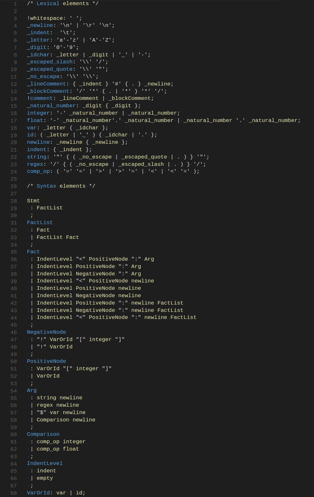
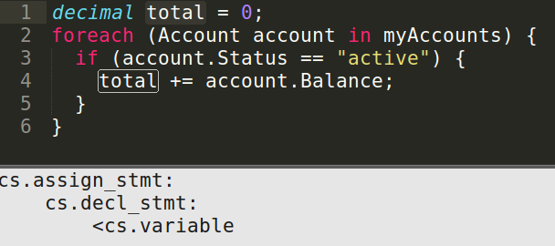

# CLQL
#### A Query Language for Software Systems

Tenets are written in the CodeLingo Query Language (CLQL). CLQL is a simple, lightweight language. It’s full grammar is under 70 lines of code:



<br />

### Query Generation
 
Most often, a Tenet will be describing a particular pattern in code. To ease the process of writing a Tenet, the CLQL queries can be generated by selecting the code of interest in your IDE:


 
Since the break statement is selected, the generated query will return any break statement nested in code similar to the above.
 
First, this query searches for all foreach statements. Then it searches within the block of statements (hence cs.block_stmt) that makes up the foreach’s body. Then it searches for if statements, and finally it searches the if statement bodies for break statements and returns them. 
 
The query will also match in cases where the elements are deeply nested, i.e. if there are any other intervening elements, like an extra if statement:


 
In general, a generated query will describe the selected element and its position in the structure of the program. 

<br />

### Facts and Basic Querying

<!--Should we include systems that CLQL does not *yet* support? -->
CLQL can query many types of software related systems, including version control systems, file systems, and code itself. For simplicity, this document will begin by assuming that queries are run on a single CSharp program. 

<!--TODONOW link to fact definition section on lexicon page-->
Queries are made up of [Facts](lexicons.md). A CLQL query with just a single fact will match all elements of that type in the program. The following query matches and returns all classes in the queried program:

`<cs.class` 

It consists of a single fact `<cs.class`. The namespace `cs`This fact is made up of a yield tag `<`, a lexicon id `cs`, and a fact name.
 
The yield tag indicates which fact you want to return. Every query must have one (and only one) yielded fact.
 
The lexicon id tells the CodeLingo backend how to analyse your repository. In particular, the csharp lexicon tells the backend to parse your code into an AST for static analysis.
 
The fact name specifies the exact sort of you are interested in. Each lexicon has a set of associated facts, for example, you can also query `cs.int`, `cs.method`, etc. A full list of facts for a given lexicon is available with the `lingo list-facts <owner>/<lexicon>` command.

<br />

### Facts with Properties
 
It is rare that you are interested in all classes, or all methods as above. We can query for elements with specific properties like so:
 
```
<cs.method:
  name: "myFunc"
```
 
This query returns all methods with the name "myFunc". Note that the yield tag is still on the `method` fact - you can't return properties, only the elements they belong to.  Also note that properties are not namespaces, as their namespace is implied from the fact they hang off.

<br />

### Floats and Ints

Not all properties are strings, there are also floats and ints. This query finds all int literals with the value 8:
 
```
<cs.int_lit:
  value: 5
```
 
Similarly we can find a float with the value 8.7:
 
```
<cs.float_lit:
  value: 8.7
```

<br />

### Comparison

The comparison operators >, <, ==, >=, and <= are available for floats and ints. We can query all int literals above negative 3 like so:
```
<cs.int_lit:
  value: >-3
```

<br />

### Regex

Any string property can be queried with regex. We can find all methods with names longer than 25 characters like so:
 
```
<cs.method:
  name: /^.{25,}$/
```

<br />
 
### Fact Nesting

As seen in the query generation example, you can nest facts inside other facts. We can find all the methods inside of “myClass” class like so:
 
```
cs.class:
  name: “myClass”
  <cs.method
```
 
Note that `<cs.method` does not end in a colon, since it has no arguments - it has no properties or other facts nested inside it.
 
You can put the yield tag on any fact in a query. If you put it on the `cs.class`, the query would return the “myClass” class, but only if it has at least one method:
 
```
cs.class:
  name: “myClass”
  <cs.method
```
 
Any fact in a query can have properties. You can find a specific method of a specific class with:
 
```
cs.class:
  name: “myClass”
  <cs.method:
    Name: “myMethod”
```

<br />

### Branching

So far each fact has only had one child fact, but facts can have an arbitrary number of children. We can find a method with a foreach loop, an if statement, and a method call with:
 
```
<cs.method:
  cs.if_stmt
  cs.foreach_stmt
  cs.method_call
```
 
The order of the children will not change the meaning of the query.
 
Similarly, facts can have arbitrarily many properties, and we can find methods with long names a many arguments with:

```
<cs.method:
  name: /^.{25,}$/
  arg-num: > 6
```

<br />

### Negation

Sometimes you are interested in all the elements that don’t have a given property. We can query for every class except the “boringClass” using “!” for negation:

```
<cs.class:
  !name: “boringClass”
```
 
Negation can apply to both facts and properties. This query will find all classes with String methods:

```
<cs.class:
  !cs.method:
    name: “String”
```
 
Be careful to place the negation on the right fact/property - this similar query finds all methods with a method that is not called string:

```
<cs.class:
  cs.method:
    !name: “String”
```
 
Negating a fact does not affect its siblings. This query finds all string methods that use an if statement, but don’t use a foreach statement:

```
<cs.method:
  name: “String”
  cs.if_stmt
  !cs.foreach_stmt
```
 
You cannot use a negation on the yielded fact.

<br />

### Or

If a fact has multiple children, it will match against elements of the code that have child1 *and* child2 *and* child3 etc. We use the “or” operator to override the implicit and.  We can query all string methods that use basic loops like so:

```
<cs.method:
  name: “String”
  or:
    cs.foreach_stmt
    cs.while_stmt
    cs.for_stmt
```

<br />

### Variables

Sometimes you want to compare elements that do not have a direct parent-child relationship. For example, you can compare two classes and see which methods they both implement:

```
cs.class:
  name: “classA”
  <cs.method:
    name: $methodName
cs.class:
  name: “classB”
  cs.method:
    name: $methodName
```

Any argument starting with “$” defines a variable. The query above will only return methods of classA for which classB has a corresponding method.

<br />
 
### Interleaving

CLQL can be used to query source code, but it can also be used to query other domains of knowledge like Version Control Systems. In our previous examples, we assumed our queries were limited to the current state of our local project. By default the lingo tool scopes your queries to the current state of your local project by default, you can override that and do a fully explicit query. 
 
If you are using Git, you can recreate the basic class finding query like this:

```
git.repo:
  name: “yourRepo”
  owner: “you”
  host: “local”
  git.commit: 
    sha: “HEAD”    
    cs.project:
      <cs.class
```
 
You can use this to query for changes in the code over time. For example, we can check if a given method has increased its number of arguments:
 
```
git.repo:
  name: “yourRepo”
  owner: “you”
  host: “local”
  git.commit: 
    sha: “HEAD^”
    cs.project:
      cs.method:
        arg-num: $args
  git.commit:
  sha: “HEAD”    
  cs.project:
    <cs.method:
      arg-num: > $args
```

# Use Cases

<br />

### CSharp

Someimtes iterative code can be more safely expressed declaratively using LINQ. For example: 

```
decimal total = 0;
foreach (Account account in myAccounts) {
  if (account.Status == "active") {
  total += account.Balance;
  }
}
```

can be expressed with:

```
decimal total = (from account in myAccounts
          where account.Status == "active"
          select account.Balance).Sum();
```

The CLQL to match this pattern should find all variables that are declared before a foreach statement, and are incremented within the loop. The facts for incrementing inside a foreach loop, and declaring a variable can be generated in the IDE:




Then the generated code can be turned into a working query by combining the above queries under the same file and scope, removing extraneous facts, and using a CLQL variable to ensure that the `cs.variable` facts are refering to the same variable:

```
cs.file:
  cs.block_stmt:
    cs.assign_stmt:
      cs.decl_stmt:
        cs.variable:
          name: $varName
    <cs.foreach_stmt:
      cs.increment_by_expr:
        cs.variable:
          name: $varName
```

<br />

### C++

Functions should not return local objects by reference. When the function returns and the stack is unwrapped, that object will be destructed, and the reference will not point to anything.

The following query matches finds this bug by matching all functions that return a reference type, and declare the returned value inside the function body:

```
<cc.func_decl:
  cc.func_header:
    cc.return_type:
      cc.reference
  cc.block_stmt:
    cc.declaration_stmt:
      cc.variable:
        name: $returnedReference
    cc.return_stmt:
      cc.variable:
        name: $returnedReference
```


<!--- 
TODO(BlakeMScurr) fully fill out template
 
We can write the same Tenet with the Common AST lexicon, which would catch the pattern in both languages as the Common lexicon lets us express facts that apply commonly across all languages:
 
[common lexicon example]
 
A Tenet can be made of interleaved facts from different lexicons.
 

[update imports to begin with lexicon type: ast/codelingo/common]
[add name matching to funcs above]
 
[Explain above query]. In a similar fashion, a runtime fact can be interleaved with an AST fact:
 
[example of code blocks that have > x memory allocated (run golang’s pprof to get an idea)]
 
Further examples can be found in the [link to Tenet examples directory].


-->