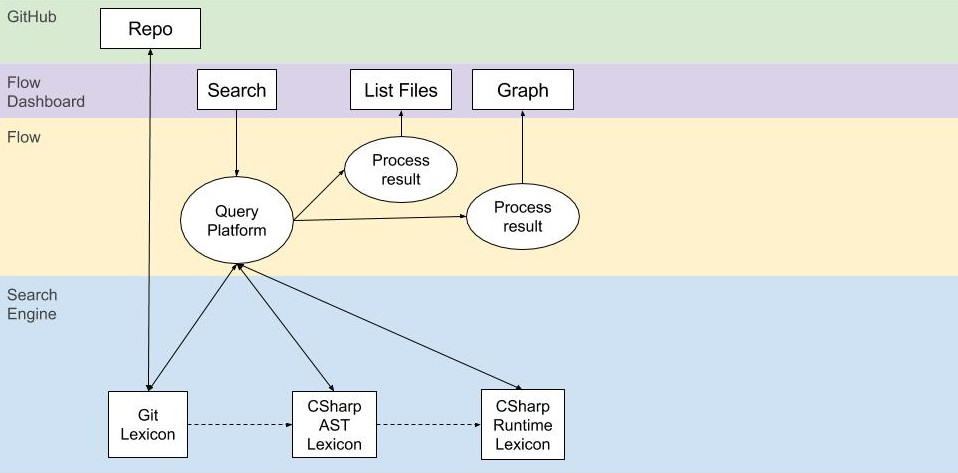
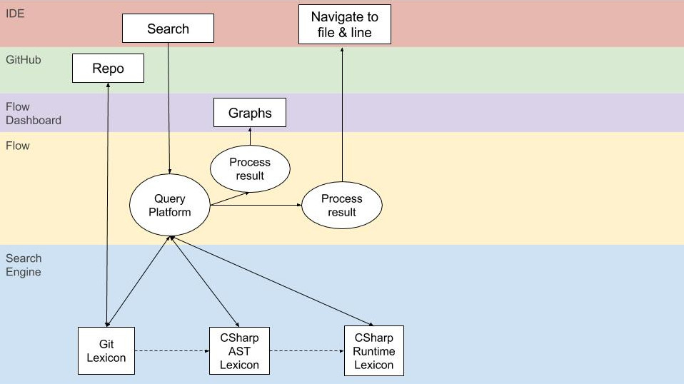
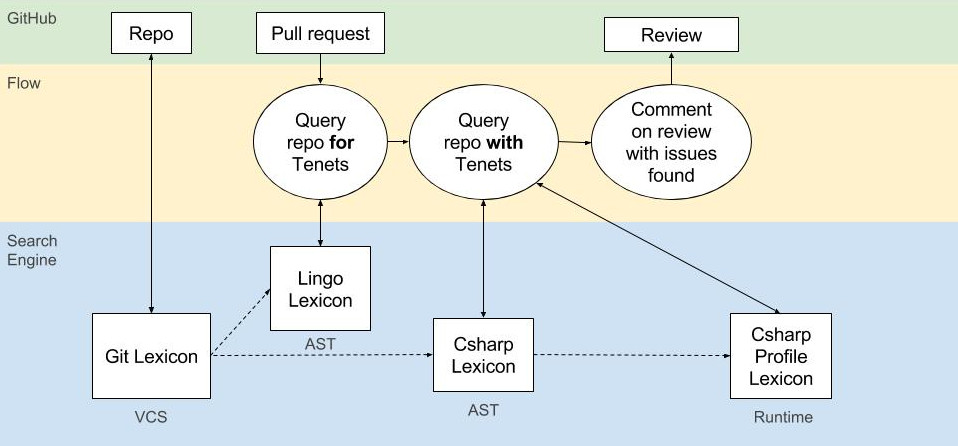
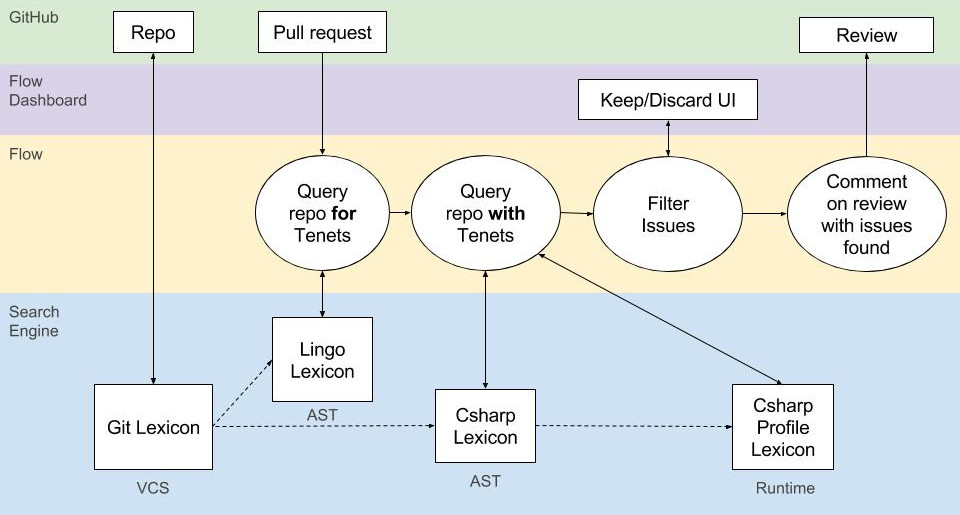
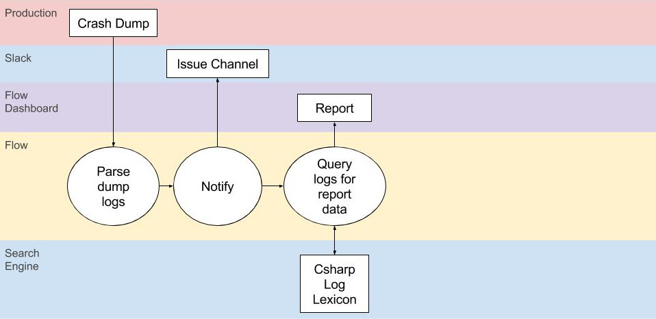
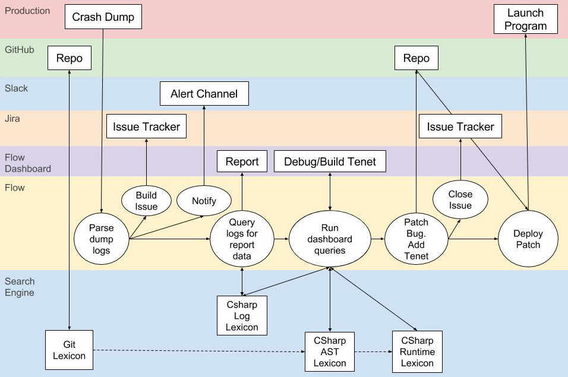

  

  Please note: Flows and Functions are currently under heavily development. If you are interested in working with more complex Flows than are currently available please do not hesitate to <a href="/help" class="drift-open-chat">contact us.</a>

# Flows
Flows automate common developer and sysadmin tasks by chaining together a pipeline of Functions. Each Flow has its own dashboard with panels generated by the Functions in it.

The default Flow provided with CodeLingo is the [Review Flow](#review-flow). Additional Flows can be configured directly in YAML or via the Flow Composer GUI. This allows custom debug dashboards, crash reports, code review UIs and monitoring systems to be composed quickly and easily.

## Functions
Functions watch resources and look for patterns in them based on the Tenets associated with the resource.

Functions can either inject information (such as pull request info or log files) or output information to a service (github comments or dashboard panels)

Possible Functions include:

- A forensic Function that analyses logs and finds event B happened before A, which violates a Tenet
- A project overview Function that graphs Tech Debt burndown chart and delegates based on ownership
- A Copilot Function that gives real time feedback to a developer in their IDE as they’re coding
- A profiling Function that detects high memory usage correlated to similar code
- A crash report Function that monitors a running system and reports on unexpected runtime information

## Examples

### Search Flow

This Flow builds a simple search dashboard with three panels: a CLQL search field, a list of file and line matches and a graph.

In this example, the executed query is searching runtime and AST information about a CSharp repository stored in a GitHub repository. To answer the query, the CodeLingo Platform fires up three lexicons: the Git Lexicon retrieves the code from the GitHub repository, the AST lexicon queries the code and the Runtime lexicon builds and runs the code and queries its runtime information.

### IDE Search Flow

Interacting with Flows is not restricted to the Flow Dashboard. Functions can receive input and give output to other external services.

In this example a CodeLingo IDE plugin allows the user to query code within their IDE and navigate to the result, while also generating a graph of the results on the Flow Dashboard.

### Review Flow

This is an example of a fully automated flow with no dashboard. When a pull request is made to the monitored repository, GitHub sends a webhook to the Function. That Function then queries the pull request and repository for any Tenets.

The next Function in the Flow then queries the pull request with the Tenets. Any issues found are added as comments on the pull request.

### Review Confirm Flow

This is the same flow as above except a Function waits for a human to confirm each found issue, via the dashboard, before commenting on the pull request.

Further customization of this Flow might include categorizing the issues and keeping track of which Tenets where kept and discarded.

### Crash Report Flow

The crashed program has a single function added to it which sends the stack trace and any other data to the Function in the Flow. The team is notified via Slack and a crash report is generated, ready to be analysed by a human.

Similar to the example above, this is a long running Flow which waits to be triggered by an external resource.

### Crash Redeploy Flow

This Flow extends the above crash report Flow to add in debugging, fixing and preventing. First the crash dump is sent, an issue is added on Jira and the team are alerted on Slack.

Along with the report panels, debug panels are added to help narrow down the cause of the crash and generate a Tenet to protect against future occurrences. The Lexicons reproduce a running state of the software, which matches, as close as possible, that of the crashed program with the information provided.

