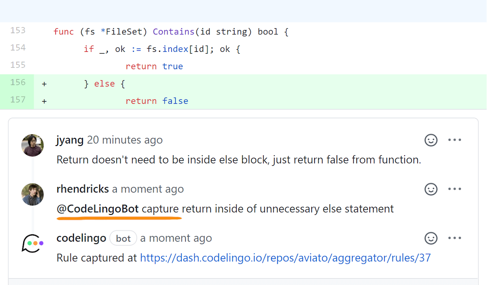

# @CodeLingoBot

We can send CodeLingo commands by @mentioning `CodeLingoBot` in a Pull Request
comment or as reply to a CodeLingo review comment.

##Commands

### Capture

```
@CodeLingoBot capture [<title>] [<description>]
```

The capture command adds a new draft rule to your dashboard under the repo the command was
made in.

Capturing allows us to capture context that will be the source of a new rule. 
The draft rule will reference where it was captured from.

Optionally, append a title and description to prepopulate the rule.




### Reply

```
@CodeLingoBot [<your reply content>]
```

Replying to a CodeLingo review comment whilst mentioning @CodeLingoBot will add the reply 
to the corresponding rule discussion thread on the dashboard.

### Review

```
@CodeLingoBot review
```

The review command triggers a fresh review on the Pull Request.

### Mute


```
@CodeLingoBot mute
```

Replying to a CodeLingo review comment with the mute command will mute the review comment in future reviews on this
Pull Request.

### Unmute


```
@CodeLingoBot unmute
```

The unmute command will unmute a muted review comment.


### Help


```
@CodeLingoBot help
```

The help command will send a link to this page.
