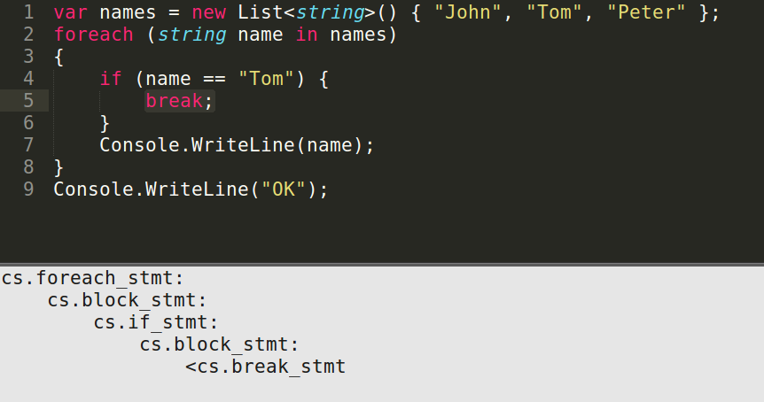

# Overview

Tenets live in codelingo.yaml files in your repository and are used by Flows to automate tasks. You can think of a Tenet as an underlying principle guiding a workflow.

In the Tenet [sprintf](https://www.codelingo.io/tenets/codelingo/go/sprintf) below, the Review Flow uses the Tenet to make sure `errors.New` is being used correctly and attaches a comment to the line where the `go.call_expr` is found, using the `@review comment` decorator:

```yaml
tenets:
  - name: sprintf
    flows:
      codelingo/docs:
        body: Find instances of 'errors.New(fmt.Sprintf(...))'.
      codelingo/review:
        comment: Should replace errors.New(fmt.Sprintf(...)) with errors.Errorf(...).
    query: |
      import codelingo/ast/go
  
      @review comment
      go.call_expr(depth = any)
        go.selector_expr:
          go.ident:
            name == "errors"
          go.ident:
            name == "New"
        go.args:
          go.call_expr:
            go.selector_expr:
              go.ident:
                name == "fmt"
              go.ident:
                name == "Sprintf"
```

Examples of problems that can be solved with Tenets & Flows include:

- Project specific practices: scaling the tacit knowledge of senior engineers to the whole team.
- Infrastructure specific guidelines / safeguards: learning from failures.
- Change management: large scale incremental refactoring.
- Packaging the author’s guidance with a library.
- Anything a static linter expresses, with a fraction of the code.

# Adding Tenets

There are three ways to add Tenets to a codelingo.yaml file:

1. The easiest is to import a bundle of Tenets:

```yaml
tenets:
  - import: codelingo/go
```

In the example above `codelingo` is the Bundle owner and `go` is the Bundle name. More Tenet bundles from the CodeLingo community can be found [here](https://www.codelingo.io/tenets).

2. The second way is to import individual Tenets from a Bundle:

```yaml
tenets:
  - import: codelingo/go/goto
  - import: codelingo/go/sprintf
```

3. The third way is to write a new Tenet directly in the codelingo.yaml file:

```yaml
tenets:
  - name: find-funcs
    flows:
      codelingo/docs:
        title: "Example Tenet that finds all func decls"
      codelingo/review:
        comment: "This is a function."

    query:
      import codelingo/ast/go
  
      @review comment
      go.func_decl
```

<br/>

# Structure of a Tenet

A Tenet consists of [Metadata](#metadata), [Flows](#flows), and the [Query](#query) itself.

```yaml
# ...
tenets:
  - name: # ...
    flows: # ...
    query: # ...
# ...
```

## Metadata

Metadata describes the Tenet. It is used for discovery and documentation. The `name` uniquely names the Tenet within the Bundle and the other Tenets that may be in the same codelingo.yaml, for example:

```yaml
# ...
tenets:
  - name: four-or-less
    flows: 
    # ...
    query:
# ...
```

## Flows

Tenets on their own do nothing until a Flow uses it. The Flow section configures the Flows that can use this Tenet, for example:

```yaml
# ...
flows:
  codelingo/review:
    comment: "This is a function."
# ...
```

## Query

The query is made up of three parts:

- Import statement to include the relevant [Lexicon(s)](CLQL.md#lexicons)
- The statement of CLQL Facts
- Decorators which extract features of interest to Flow Functions

For example:

```yaml
# ...
tenets:
  - # ...
    query:
      import codelingo/ast/php         # import statement

      @review comment                  # Flow Function decorator
      php.stmt_function(depth = any)  # the CLQL fact statement
# ...
```

Here we've imported the PHP Lexicon and are looking for function statements at any depth, which is to say we're looking for functions defined anywhere in the target repository. Once one is found, the Review Flow is going to attach it's comment to the file and line number of that function.

Here is a more complex example:

```yaml
# ...
tenets:
  - name: debug-prints
    flows: # ...
    query: |
      import codelingo/ast/python36

      @review comment
      python36.expr(depth = any):
        python36.call:
          python36.name:
            id == "print"
# ...
```

This particular Tenet looks for debug prints in Python code.

Note: The decorator `@review comment` is what integrates the Tenet into the Review Flow, detailing where the comment should be made when the pattern matches. Generally speaking, query decorators are metadata on queries that functions use to extract named information from the query result.
<!-- TODO add more decorators example -->

## Flow Functions

Flows are made up of a pipeline of serverless functions, called Flow Functions.

In the example below, the review function builds a comment from a Tenet query which can be used by a Flow to comment on a Pull Request made to Github, Bitbucket, Gitlab or the like. It does this by extracting the file name, start line and end line to attach the comment to via the `@review comment` Flow Function query decorator. See [Query Decorators as Feature Extractors](#query) for more details.

```yaml
# ...
tenets:
  - name: four-or-less
    flows:
      codelingo/review:
        comment: Please write functions that only take a maximum of four arguments.
    query:
      import codelingo/ast/php
      @review comment
      php.stmt_function(depth = any)
# ...
```

# Writing Tenets

Follow these steps for writing Tenets for your own requirements:

- Create a new codelingo.yaml file and open in your favourite text editor.

- Create a `tenets` key that will contain your Tenet(s).

```yaml
# ...
tenets: 

# ...
```

- Define your Tenet `name`

```yaml
# ...
tenets: 
  - name: my-first-tenet

# ...
```

- Identify what Lexicon(s) will be required (view available Lexicons via [the CodeLingo repository.](https://github.com/codelingo/codelingo/tree/master/lexicons))

- Import the Lexicon(s) into your Tenet. (e.g.`import codelingo/ast/csharp`).

- Write the specific `query` you are interested in; using the Facts provided by the Lexicon. You can use one of the [IDE plugins](#ide-integration) or the [playground](https://www.codelingo.io/playground) to help you!

- Add the relevant Flow configs and decorators.

- Add [Asserter](CLQL.md#Asserters) and [Resolver](CLQL.md#Resolvers) functions if needed to the codelingo.yaml.

- (_optional_) [Share your Tenet with the CodeLingo community!](#share-your-tenet-with-the-codelingo-community).

If your having any trouble writing Tenets ping the team on [Slack](https://codelingo.slack.com/join/shared_invite/enQtNDYxOTYyNTI5NjUwLWFiNjFjOTM3YzgzMjA4NjNiNDhmN2RkZWNlODM0ZTM5NTkzOThhZjczN2ZlYmNkMjhkNDBkYjBlMjQ1NDk2NTQ). We'd love to help you out :)

# Testing Tenets

Testing your Tenet on test code is an essential part of the process and ensures that your Tenet is working correctly before you use it on your codebase. Follow these steps to test your Tenet.

- Put your codelingo.yaml in a new folder named after the Tenet e.g sprintf
- Add some example code files in this folder to test your Tenet against e.g test.go
- Create a new test repository inside this folder and make a commit to it. This is so that lingo knows what code to query.
```
$ git init
$ git add .
$ git commit -m "initial commit"
```
- Run lingo i.e `$ lingo run review` and make sure that lingo works as expected on the test code.

<br/>

# Publishing Tenets

Follow these steps to publish your Tenet and share with the CodeLingo community!

- Clone the CodeLingo GitHub repository:
```
$ git clone https://github.com/codelingo/codelingo
```
- Create a new git branch:
```
$ git checkout -b my_first_tenet
```
- Create your CodeLingo hub under codelingo/tenets by creating a folder named after your username e.g codelingo/tenets/rstorr.
- Create a new Bundle inside your hub. For example, I may want a Bundle of Tenets that I will use to ensure the quality of my code for my 'cool project' so I create a new folder named cool-project inside my hub i.e codelingo/tenets/rstorr/cool-project.
- Inside your Bundle create a new folder named after your Tenet(s) that will be in your codelingo.yaml.
- Inside this folder add your codelingo.yaml.
- Add README's inside your Bundle and each of your Tenet(s) folders so the community knows the purpose of the Bundle and its Tenets.
- Git add, commit and push your new Bundle and Tenet(s) to the CodeLingo repository.
- Now others can use your Tenet(s) to automatically review and rewrite their code!
- Give yourself a pat on the back for publishing your first Tenet. Thanks for being a part of the CodeLingo community! 

If your having any trouble publishing Tenets ping the team on [Slack](https://codelingo.slack.com/join/shared_invite/enQtNDYxOTYyNTI5NjUwLWFiNjFjOTM3YzgzMjA4NjNiNDhmN2RkZWNlODM0ZTM5NTkzOThhZjczN2ZlYmNkMjhkNDBkYjBlMjQ1NDk2NTQ). We'd love to help you out :)

<br/>

# IDE Integration

CodeLingo integrates with your IDE to provide support for writing and running CLQL queries (Tenets):

## Sublime

<a href="https://github.com/codelingo/ideplugins/tree/master/sublime" target="_blank">View Subline plugin README</a>

CodeLingo's Integrated Development Environment (IDE) plugins can help build patterns in code by automatically generating queries to detect selected elements of programs. A generated query will describe the selected element and its position in the structure of the program:



In the above example, a string literal is selected. The generated CLQL query will match any literal directly inside an assignment statement, in a function declaration, matching the nested pattern of the selected literal.

## Vistual Studio

<a href="https://github.com/codelingo/ideplugins/tree/master/vs" target="_blank">View Visual Studio extension README</a>

## VIM

Vim also has full support for the Lingo syntax, including CLQL. To set it up:

- Download [lingo.vim](../resources/lingo.vim)
- Copy to `~/.vim/syntax/lingo.vim`
- Enable in vim with `:set syntax=lingo`
- Auto enable on `codelingo.yaml` file open by adding the following line to `~/.vimrc`

```
au BufRead,BufNewFile codelingo.yaml set syntax=lingo
```

Other than the match statement, written in CLQL, the rest of a codelingo.yaml file is written in YAML. As such, you can set codelingo.yaml files to YAML syntax in your IDE to get partial highlighting.
