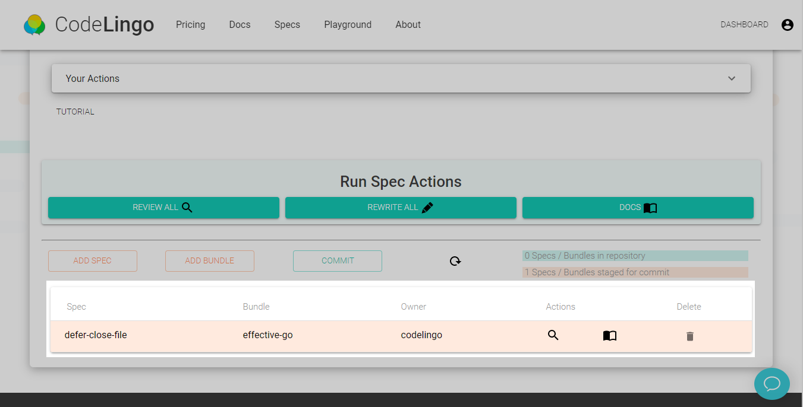
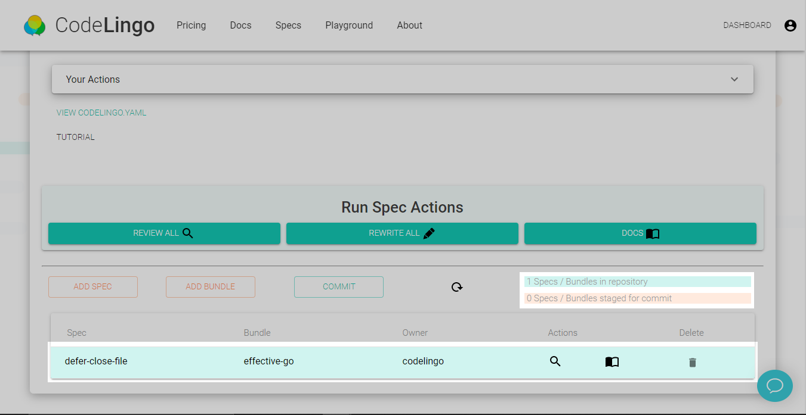
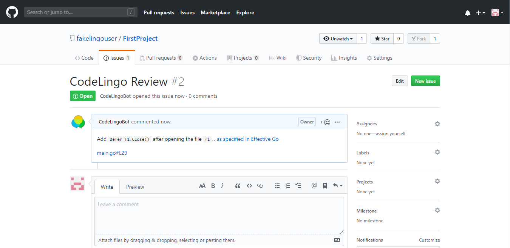

# Getting Started

## Introduction

There are two ways to leverage CodeLingo Actions to automate your workflows, the [CodeLingo Dashboard](https://www.codelingo.io/dashboard) and the [CodeLingo GitHub App](https://github.com/apps/codelingo). Below is an example demonstrating how to use the CodeLingo Dashboard to run an automated code-review and employ the CodeLingo GitHub App to protect against future issues being introduced in Pull Requests.

## Automated Code-Review Example

This example will be a simple demonstration of using the CodeLingo Review Action to automatically find issues in a codebase and prevent them from returning by reviewing each new Pull Request made to the repository. A quicker tutorial can be found on the [CodeLingo Dashboard](https://www.codelingo.io/dashboard). To use CodeLingo for free you must have your code in public repositories on GitHub (GitLab and BitBucket support coming soon).

To begin go the [CodeLingo Dashboard](https://www.codelingo.io/dashboard) and click on `sign in with github` in the top right of the screen. CodeLingo uses [Auth0](https://auth0.com/) to authenticate users so you will be asked to authorize Auth0 to access your email address before being redirected to the CodeLingo Dashboard. The Dashboard acts as a hub for importing Specs and Spec Bundles into your GitHub repository and running Actions such as the CodeLingo Review Action. To do this, click on `install on github` to install the [CodeLingo GitHub App](https://github.com/apps/codelingo) and follow the prompts. You may choose to authorize the CodeLingo GitHub App on all of your public repositories or just the ones you select but keep in mind CodeLingo will never alter your code without your permission. After the CodeLingo GutHub App is successfully installed return to the Dashboard.

CodeLingo works by using what we call Specs, which can be thought of as specifications of anti-patterns or best practice and are expressed using CLQL (Code Lingo Query Language). You can read more about CodeLingo Specs [here](concepts/specs.md), but to demonstrate we just need to know that Specs are defined in codelingo.yaml files at the root of a repository. The dashboard makes it simple to add and remove Specs and Spec Bundles from a GitHub repository.

For this example we will add the [defer-close-file](https://www.codelingo.io/specs/codelingo/effective-go/defer-close-file) Spec from the Effective Go Bundle to a small example repository. This Spec identifies any case of a file that has been opened using the Golang [OS](https://golang.org/pkg/os/) package and recommends adding `defer <file>.Close()`. 

We do this by selecting the repository and clicking on `Add Spec`, then searching for `defer-close-file`. After adding the Spec you should see it listed as shown below:

Notice that `defer-close-file` is now listed under Specs, we can use the Review Action to create GitHub Issues for the repository as well as commenting on any instance of an unclosed file in Pull Requests made to the repository. Clicking on `Commit` creates a Pull Request made by the CodeLingoBot adding the Spec to the repository. After merging the Pull Request, return to the CodeLingo Dashboard and refresh the page.

You will notice the Spec is now listed in blue in this repository signifying that it can now be used by CodeLingo Actions.

We can now run an automated code-review by pressing `REVIEW ALL`. CodeLingo will run the Review Action and use `defer-close-file` Spec to identify unclosed files. After the Action has completed, the following Issue is created on the GitHub Repository:

From now on the CodeLingoBot will automatically review subsequent Pull Requests made to the repository. If the same issue is then introduced in subsequent Pull Request, the CodeLingoBot will comment as such:


Note: Actions can be used to build any custom workflow. Whether that's generating custom reports on your project dashboard, or integrations with your existing tools and services through Functions.

If you are interested in building custom Actions and integrations, please contact us directly at:
 [hello@codelingo.io](hello@codelingo.io).


## Lingo - CodeLingo CLI

CodeLingo can be configured and executed from the command line using the CodeLingo CLI tool Lingo. The primary reason for using Lingo is the development of custom Specs. Follow this guide to install and configure Lingo locally so you can begin encoding your own best practices in custom Specs.

### Installation

Download a pre-built binary or, if you have Golang setup, install from source:

$ git clone https://github.com/codelingo/lingo $GOPATH/src/github.com/codelingo/lingo
$ cd $GOPATH/src/github.com/codelingo/lingo
$ make install

This will download, build and place the lingo binary on your $PATH

#### Windows

NOTE: The lingo update command and the auto-update feature does not support Windows. To update lingo, follow these instructions again with the newer binary.
Put the binary in a folder listed in your %PATH%. If you don't have an appropriate folder set up, create a new one (ie C:\Lingo) and append it to PATH with a ; in between by going to Control Panel\System and Security\System -> Advanced system settings -> Environment Variables

#### Linux / Unix

Place the lingo binary on your $PATH, either:
Open ~/.bashrc and add the line export PATH=$PATH:/path/to/folder/containing/lingo-binary for wherever you would like the binary to be. Or put the binary on your current $PATH. Note: You can find your current $PATH by running:
$ echo $PATH
 
### Authentication

Next you need to authenticate your Lingo client with the CodeLingo servers. This requires you to have an account with CodeLingo, if you do not already have one go to CodeLingo.io and select SIGN IN WITH GITHUB in the top right corner. Complete the following steps:
Generate a token to authorize your client here https://www.codelingo.io/settings/profile

Return to the command line and run $lingo config setup
Enter your CodeLingo username, this can be found by clicking on your profile in the top right of codelingo.io
Enter your token

You should see a success message meaning the client is now authenticated to use the CodeLingo servers.

### Installing and Running Actions

In a new or existing git repository, run - $ lingo init -  to create a template Spec in a codelingo.yaml file at the root of the repository.
The two primary concepts of CodeLingo are Actions and Specs. Actions are installed using the command - $ lingo install <action> - and specs are defined in a codelingo.yaml file at the root of the repository. 

Install the CodeLingo Review Action with - $ ligno install review - now any specs defined in your codelingo.yaml file that specify codelingo/review under Actions will be used in automated code-reviews.

Specs can be imported from the codelingo Spec Hub using the format:

```yaml
specs:
  - import: <author>/<bundle>/<name>
```

For example:

```yaml
specs: 
  import: codelingo/effective-go/defer-close-file
```

Replace the contents of your codelingo.yaml file with the above to run a CodeLingo Review and check that everything is working as expected. The Spec defer-close-file will identify code segments of Golang in which files opened with the OS package are left open. Create a Golang program with unclosed files or copy and paste the following [example](https://github.com/codelingo/codelingo/blob/master/tenets/codelingo/effective-go/defer-close-file/test.go) into the root of your repositoty.

Run - $ lingo run review - to execute an automated code-review, the terminal will present you with each unclosed file in sequence and give you the option to either ignore, or open the file at that line.

TODO: Include screenshot of successful review

## Next Steps

Now that you have basic integration with CodeLingo into your project, you can start to add additional Specs and build custom workflow augmentation.
<br/><br/>
**[Explore published Specs to add to your project](https://www.codelingo.io/specs)**
<br/><br/>
**[View guide to importing and writing Specs](https://www.codelingo.io/docs/concepts/specs/)**
