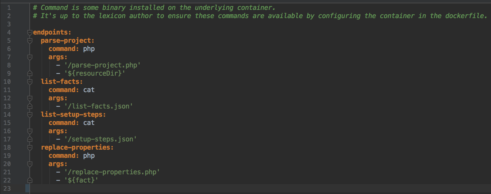
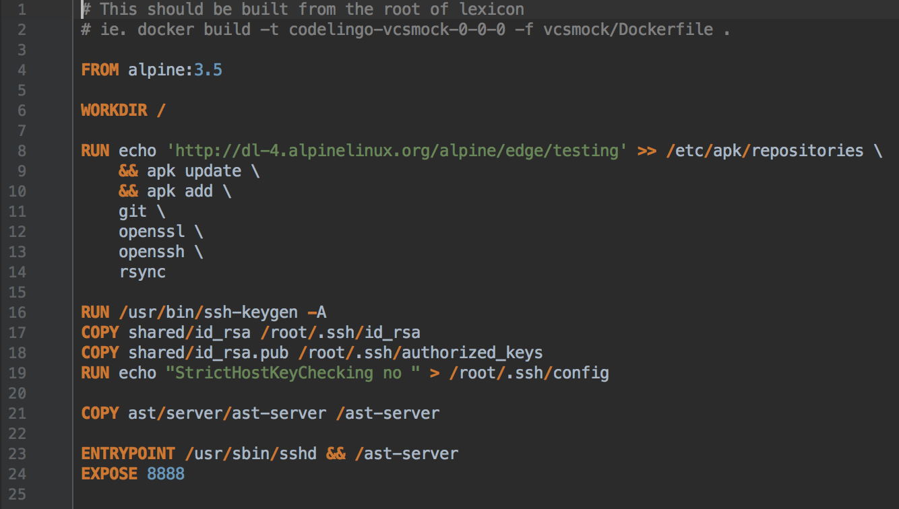

# Lexicon SDK
This tutorial explains how to make a new AST lexicon from start to finish and touches on how the lexicons and platform tie in together.
 
 
## Overview
Different AST lexicons are all very similar. They all need to listen to incoming requests, handle resources, and send back sensible responses. Fortunately, all this grunt work has already been done in a generic server. As a lexicon author, you only need to satisfy a few interfaces for the generic server to get a fully functioning lexicon running with the CodeLingo platform.
 
From a top down approach, a lexicon author only needs to:
Implement a server-config.yaml
Write commands to satisfy the server-config.yaml
Write a Dockerfile to make the lexicon
Push the docker image up to the Codelingo registry


## Server-config.yaml
The server-config.yaml is what specialises a generic server into a working lexicon. There are a few functions on the generic server that depend on the server-config.yaml file. 



As seen above, these functions look in the config file for a key that corresponds to their function name. When the key is found, they get back a command and a list of arguments, which is then executed on the operating system. Note; the command must exist on the lexicon’s underlying OS. Lexicon authors specify which OS and packages to install in the Dockerfile.
 
 
## Commands
There are 4 commands that must be implemented:
* parse-project
* list-facts
* list-setup-steps
* replace-properties
 
Each one of these commands must return a generic JSON response for the server to understand:
```json
{
	"data": <your json data here>,
	"error": <null or error string>
}
```
 
Each command also has a specific data format that needs to be returned in JSON so it can be unmarshalled into native types by the generic server.
 

## Dockerfile
If you’re not familiar with Dockerfiles, read up here: https://docs.docker.com/engine/reference/builder/
 

 
A lexicon author needs to write a Dockerfile to support the commands they have written, as well as setting up the generic server. So if your commands use PHP, PHP and any dependencies need to be installed onto the Docker image.
 
All the commands in the above image must be in each Dockerfile as it's the bare minimum required to make the generic server run correctly.
 
 
## Push to registry
The CodeLingo image registry is currently hosted privately with Google Container Registry. You will first need to install the GCloud CLI tool from https://cloud.google.com/sdk/downloads and authenticate yourself with an email address approved by CodeLingo.
 
