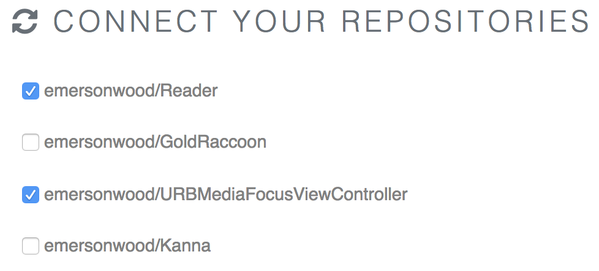
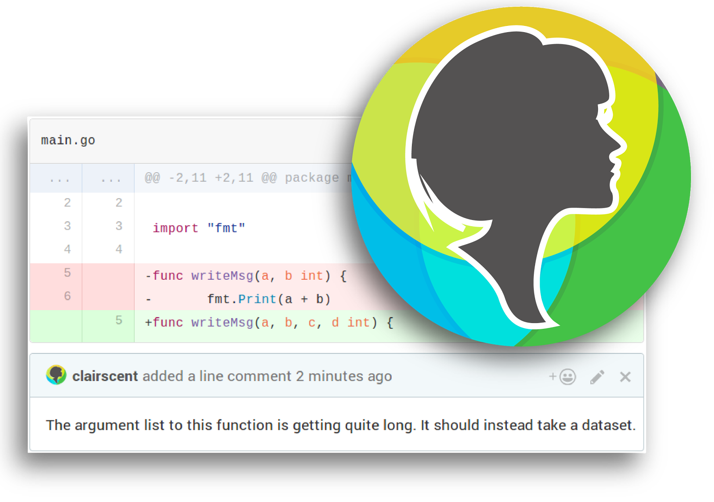

# Getting started with CLAIR

CLAIR (CodeLingo AI Reviewer) is a Bot that automatically reviews incoming pull requests on Github repositories.

She can be setup in a few simple steps:

1. Make sure you have [joined Codelingo](https://codelingo.io/join) and are logged in.

2. Visit the [CodeLingo Dashboard]("https://codelingo.io/dashboard).

3. Select the repositories that CLAIR should monitor.

And that's it. Now whenever a pull request is made on a monitored repo, CLAIR will write a review based on all the
tenets found in the repository.

